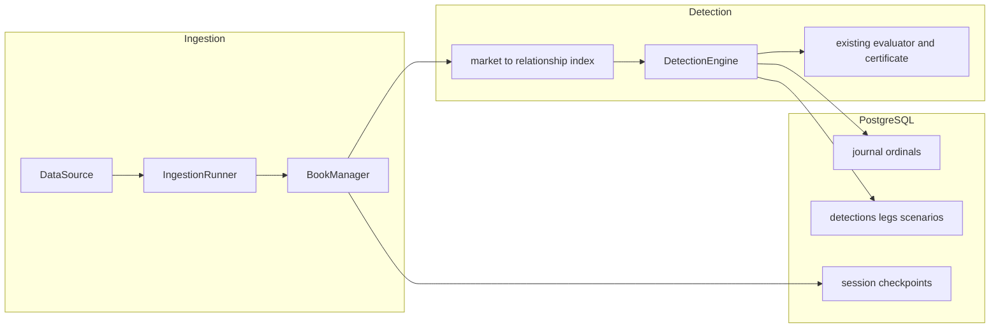

# Architecture

Milestone 2 runs one process, `consistency_worker`, from a synthetic or replay source through
books and the detection engine into PostgreSQL. The API process only answers health checks.
There is no dashboard and no public detection API yet.

## Pipeline

`PipelineListener` subscribes to the runner. A book update marks every relationship that lists
that market. The engine evaluates only those relationships, using
`consistency_core.pricing.evaluator.evaluate`. It does not reimplement pricing. A relationship
with no verified review is skipped. Consecutive evaluations of the same relationship and
portfolio direction update one detection: first and last observation, historical maxima
(max deviation, max capacity, max net edge), the latest quoted figures, status, and expiration
reason. The latest net edge is the current quote. A later smaller edge does not replace the
maximum, and the maximum is not reported as the current edge. An evaluation that repeats the
same classification, reason codes, and quoted figures emits no event. A real change in those
quoted figures emits an update, including a decrease. Clock-only changes (duration, freshness,
skew) do not.

Duration uses the existing rule: local-clock time continuously inside "all gates pass except
duration", sampled on updates and at `sweep_interval_ms` (default 100). Opening still requires
`minimum_candidate_duration_ms`.

A constituent book that becomes `UNSYNCHRONIZED`, stale, or interrupted invalidates open
detections immediately, including the desync notifications the runner already publishes.
Withdrawing a review does the same. Timing metadata follows spec §4.5: source latency is
`received_at − exchange_time`; internal latency is `detection_completed_ns −
processing_started_ns`. The two nanosecond fields are telemetry and are excluded from replay
equality.

## Worker

`DATA_SOURCE` defaults to `synthetic`. `replay` reads a recorded session. `kalshi_authorized`
stays refused until a separate authorization change. Queues are bounded. Logs are one JSON
object per line. Shutdown cancels the supervisor and drains the detection outbox before the
final checkpoint, so a checkpoint is not ahead of the rows it describes.

On a live end-of-stream the supervisor reconnects with backoff. Books are already fail-closed
from the runner's desync notification; reconnect does not mark them synchronized by itself.
A deterministic session (`synthetic` or `replay`) that stops mid-way resumes from the last
checkpoint on the same session id: journal and detections are reconciled to that checkpoint.
Reconciliation writes the certificate stored on the checkpointed detection, so a later update
cannot leave a wiped or mismatched `certificate_json`.
A non-deterministic session invalidates open detections with `SERVICE_RESTART` and starts a
new session id.

## Persistence

`consistency_persistence` is the only repository. The worker and the API both call it; neither
embeds SQL. Runtime driver is asyncpg via SQLAlchemy 2.x. Alembic revision `0001_initial`
creates every spec §11 table plus `session_checkpoints` with explicit `op.create_table`
operations. That revision does not call `metadata.create_all`, so a later model edit cannot
rewrite it.

High-frequency book rows are inserted in batches (`JOURNAL_BATCH_SIZE`). A flush keeps the
pending batch until the commit succeeds and retries it on the next flush. A detection, its legs,
its scenarios, and its certificate commit in one transaction. Synthetic and replay sessions
persist raw books unless `PERSIST_MARKET_DATA=false`. Other sources do not; see
[compliance.md](compliance.md).

## Replay

`consistency_pipeline.replay` restores the latest checkpoint at or before a timestamp, reapplies
later journal ordinals, rebuilds books, and recalculates detections. Comparison ignores
detection ids (they include the session id) and the telemetry fields above.

`PlaybackService` keeps one `PlaybackSession` per replay id: start, pause, resume, restart,
step, seek, and speeds 0.5, 1, 2, 5, and 10. Sessions do not share books or detections.
Construction and restart apply nothing. Forward play (start, resume, step, and a forward seek)
keeps one `JournalApplier` and applies each new entry once. A backward seek restores the latest
checkpoint at or before the target and applies the following entries once.
`make replay` replays the bundled inconsistent recording twice and prints whether books,
classifications, certificate hashes, and event order match.

## Notifications across processes

Phase 11's API runs in its own process. It cannot subscribe to the worker's in-memory `Broker`.
The broker remains the in-process fan-out only. Durable state is the `detections` row (legs,
scenarios, and certificate JSON), committed before the worker publishes.

The Phase 11 contract is an append-only `notification_outbox`, created by Alembic revision
`0002_notification_outbox` (not `create_all`). `DetectionWriter` inserts one row in the same
transaction as the detection, its legs, its scenarios, and its certificate. The worker's
in-memory broker is unchanged. The public API tails this table; it does not subscribe to
the worker process.

| column | type | role |
|---|---|---|
| `id` | `bigserial` primary key | cursor and SSE id |
| `topic` | `text` not null | `detection`, `market`, or `system` |
| `session_id` | `text` null | ingestion session, when the event has one |
| `payload` | `jsonb` not null | the same document the broker publishes |
| `created_at` | `timestamptz` not null | insert time; not used for ordering |

Clients resume with `Last-Event-ID` set to an outbox `id`. On connect, and when that id is
no longer a contiguous boundary, `GET /api/v1/stream` sends a `resync` event built from the
current `detections` rows (the latest row per detection, not a reconstructed history) and
then tails the outbox. Polling `detections` alone is not an event log: an update overwrites
the row. The outbox is the tail; the detection table is the snapshot. The dashboard still
polls `/app-data` until a page is switched to this stream.

### Concurrent commit order

`id` comes from `notification_outbox_id_seq` before the detection transaction commits.
`nextval` does not roll back. Assignment order is not commit order, and a rollback leaves
a hole. Readers do not query `pg_locks`. That view is live, so a commit between the
snapshot and the lock check can look like an aborted hole and the reader would skip an id
that actually committed.

`outbox_claims` (revision `0003_outbox_claims`) is the publication record. Before the
outbox row is inserted, the detection transaction reads `pg_current_xact_id()`. A second
connection holds `pg_advisory_xact_lock` only long enough to take `nextval` and commit
`(id, xid)` into `outbox_claims`. The next id is not reserved until that commit. The
detection transaction then inserts the outbox row with the reserved id and commits later,
or rolls back. The claim remains either way.

`committed_notifications` loads the outbox rows visible to its snapshot, then calls
`pg_xact_status` on the stored xid of each missing id. It does not read the outbox again
after that status check.

- A visible id is delivered.
- `aborted` is skipped. A missing id with no claim, when a later claim exists, is skipped
  too: `nextval` ran and the claim transaction rolled back, so the row was never inserted.
- `in progress` stops the cursor. A higher committed id waits.
- `committed`, while the row is absent from this snapshot, stops the cursor. The id
  committed after the snapshot. It is not an aborted hole. The next read sees the row.
- `unknown` stops the cursor. An unrelated transaction does not insert a claim, so it does
  not stall a contiguous committed prefix.

`created_at` stays the insert time and is not a cursor. The `detections` row stays the
resynchronization snapshot when the tail is uncertain. SSE `id:` is the outbox id.
Reconnecting with `Last-Event-ID` replays that boundary event so a client can apply it
idempotently. If `Last-Event-ID` is greater than every reserved or committed outbox id,
the stream sends `resync` immediately instead of waiting for an id the restored database
will not produce. See `docs/api-reference.md`.

## Dashboard

Phase 10's Next.js app reads PostgreSQL through `consistency_persistence`. A local gateway
process (`scripts/dashboard_gateway.py`, `/internal/...`) holds that access and one
`PlaybackService`. The browser talks only to Next routes under `/app-data`, which proxy the
gateway, and polls those routes. The pages label the refresh as polling. That gateway is an
internal adapter in front of the same `dashboard.py` reads and `ReplayHost` the public
`/api/v1` routes use, so the two surfaces do not keep separate calculations. `POST /internal/replay/{id}/start` and `POST /api/v1/replay/sessions/{id}/start` both fork a
viewer id. Two dashboard tabs and two API clients can seek the same recording without
sharing a cursor and without writing the canonical journal. A gateway bound to loopback
trusts the Next.js process. The browser-facing `/app-data` proxy checks an httpOnly
capability cookie and attaches `X-Replay-Token` only on the hop to the gateway. A gateway
bound to any other address requires that token itself.

Viewers idle for `REPLAY_SESSION_TTL_S` (default 1800 seconds) are dropped and their
playback tasks are cancelled. A viewer read or commanded inside that window stays, including
one that is still playing. `REPLAY_MAX_VIEWERS` (default 32) rejects another open with
`429`. `preview` of a recording that is not already an open viewer reconstructs the journal.
That reconstruction does not take a viewer slot. `REPLAY_MAX_PREVIEWS` (default 4) is the
number of those reconstructions allowed at once. Another preview fails immediately with
`429` `replay_preview_busy`. The reconstructed book is dropped before the snapshot is
returned, so it does not outlive the request. An open viewer's command does not wait on
a preview.

The browser does not receive `REPLAY_API_TOKEN`. The replay page asks
`POST /app-data/replay-capability` for an httpOnly cookie (`ce_replay_capability`,
`REPLAY_CAPABILITY_TTL_S`, default 900 seconds). That cookie is bound to the viewer id
returned by the first start. The Next route checks the cookie and attaches
`X-Replay-Token` only on the request it sends to the gateway. A capability cannot command
another viewer's id.

`GET /api/v1/stream` is the SSE tail. On connect it sends one `resync` whose detection rows
and `outbox_id` come from a single repeatable-read snapshot, with no 10 000-row cap on the
watermark. A commit that lands during that read is invisible to both and is delivered on
the tail afterwards, so an older event is not applied on top of a newer snapshot. The
stream emits `: heartbeat` comments (`SSE_HEARTBEAT_SECONDS`, default 15), refuses with
`503` above `SSE_MAX_CONNECTIONS` (default 32), and stops a client that falls more than
`SSE_QUEUE_MAX` frames behind (default 32). That client reconnects with `Last-Event-ID`.
The dashboard keeps polling until a page is switched over; a failed poll still keeps the
last successful payload. Prices stay fixed-point strings.
A depth chart scales those strings to integers for pixel positions and labels the axis from
the same scale.
