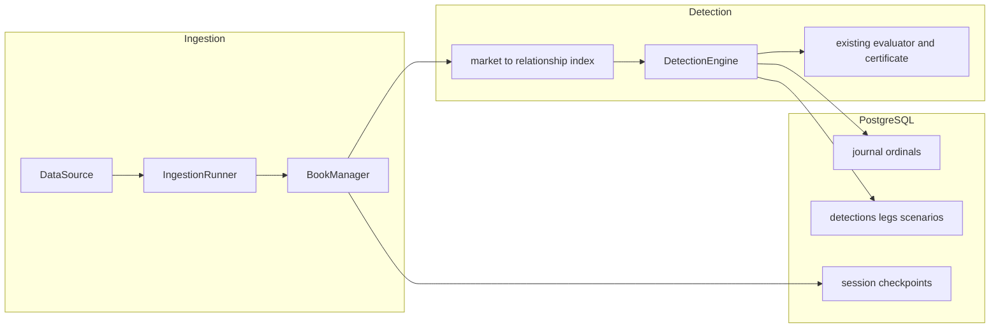

# Architecture

Milestone 2 runs one process, `consistency_worker`, from a synthetic or replay source through
books and the detection engine into PostgreSQL. The API process only answers health checks.
There is no dashboard and no public detection API yet.

## Pipeline

`PipelineListener` subscribes to the runner. A book update marks every relationship that lists
that market. The engine evaluates only those relationships, using
`consistency_core.pricing.evaluator.evaluate`. It does not reimplement pricing. A relationship
with no verified review is skipped. Consecutive evaluations of the same relationship and
portfolio direction update one detection: first and last observation, historical maxima
(max deviation, max capacity, max net edge), the latest quoted figures, status, and expiration
reason. The latest net edge is the current quote. A later smaller edge does not replace the
maximum, and the maximum is not reported as the current edge. An evaluation that repeats the
same classification, reason codes, and quoted figures emits no event. A real change in those
quoted figures emits an update, including a decrease. Clock-only changes (duration, freshness,
skew) do not.

Duration uses the existing rule: local-clock time continuously inside "all gates pass except
duration", sampled on updates and at `sweep_interval_ms` (default 100). Opening still requires
`minimum_candidate_duration_ms`.

A constituent book that becomes `UNSYNCHRONIZED`, stale, or interrupted invalidates open
detections immediately, including the desync notifications the runner already publishes.
Withdrawing a review does the same. Timing metadata follows spec §4.5: source latency is
`received_at − exchange_time`; internal latency is `detection_completed_ns −
processing_started_ns`. The two nanosecond fields are telemetry and are excluded from replay
equality.

## Worker

`DATA_SOURCE` defaults to `synthetic`. `replay` reads a recorded session. `kalshi_authorized`
stays refused until a separate authorization change. Queues are bounded. Logs are one JSON
object per line. Shutdown cancels the supervisor and drains the detection outbox before the
final checkpoint, so a checkpoint is not ahead of the rows it describes.

On a live end-of-stream the supervisor reconnects with backoff. Books are already fail-closed
from the runner's desync notification; reconnect does not mark them synchronized by itself.
A deterministic session (`synthetic` or `replay`) that stops mid-way resumes from the last
checkpoint on the same session id: journal and detections are reconciled to that checkpoint.
Reconciliation writes the certificate stored on the checkpointed detection, so a later update
cannot leave a wiped or mismatched `certificate_json`.
A non-deterministic session invalidates open detections with `SERVICE_RESTART` and starts a
new session id.

## Persistence

`consistency_persistence` is the only repository. The worker and the API both call it; neither
embeds SQL. Runtime driver is asyncpg via SQLAlchemy 2.x. Alembic revision `0001_initial`
creates every spec §11 table plus `session_checkpoints` with explicit `op.create_table`
operations. That revision does not call `metadata.create_all`, so a later model edit cannot
rewrite it.

High-frequency book rows are inserted in batches (`JOURNAL_BATCH_SIZE`). A flush keeps the
pending batch until the commit succeeds and retries it on the next flush. A detection, its legs,
its scenarios, and its certificate commit in one transaction. Synthetic and replay sessions
persist raw books unless `PERSIST_MARKET_DATA=false`. Other sources do not; see
[compliance.md](compliance.md).

## Replay

`consistency_pipeline.replay` restores the latest checkpoint at or before a timestamp, reapplies
later journal ordinals, rebuilds books, and recalculates detections. Comparison ignores
detection ids (they include the session id) and the telemetry fields above.

`PlaybackService` keeps one `PlaybackSession` per replay id: start, pause, resume, restart,
step, seek, and speeds 0.5, 1, 2, 5, and 10. Sessions do not share books or detections.
Construction and restart apply nothing. Forward play (start, resume, step, and a forward seek)
keeps one `JournalApplier` and applies each new entry once. A backward seek restores the latest
checkpoint at or before the target and applies the following entries once.
`make replay` replays the bundled inconsistent recording twice and prints whether books,
classifications, certificate hashes, and event order match.

## Notifications across processes

Phase 11's API runs in its own process. It cannot subscribe to the worker's in-memory `Broker`.
The broker remains the in-process fan-out only. Durable state is the `detections` row (legs,
scenarios, and certificate JSON), committed before the worker publishes.

The Phase 11 contract is an append-only `notification_outbox`. This pass does not create the
table and does not add REST or SSE routes. The worker stays correct without it. The next phase
adds the table in its own explicit Alembic revision and writes one row in the same transaction
as the detection change:

| column | type | role |
|---|---|---|
| `id` | `bigserial` primary key | cursor and SSE id |
| `topic` | `text` not null | `detection`, `market`, or `system` |
| `session_id` | `text` null | ingestion session, when the event has one |
| `payload` | `jsonb` not null | the same document the broker publishes |
| `created_at` | `timestamptz` not null | insert time; not used for ordering |

The API polls `WHERE id > :cursor ORDER BY id`. Clients resume with `Last-Event-ID` set to that
`id`. On startup, a gap, or a lagged cursor, the API resynchronizes from `detections` (the
current row, not a reconstructed history) and then tails the outbox from the greatest `id`
observed when that read began. Polling `detections` alone is not an event log: an update
overwrites the row. The outbox is the tail; the detection table is the snapshot.
