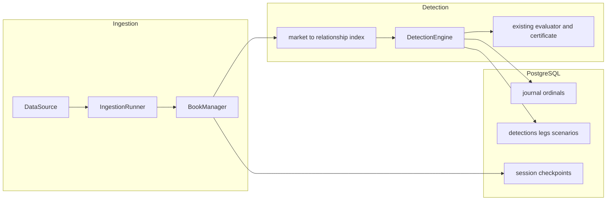

# Architecture

Milestone 2 runs one process, `consistency_worker`, from a synthetic or replay source through
books and the detection engine into PostgreSQL. The API process only answers health checks.
There is no dashboard and no public detection API yet.

## Pipeline

`PipelineListener` subscribes to the runner. A book update marks every relationship that lists
that market. The engine evaluates only those relationships, using
`consistency_core.pricing.evaluator.evaluate`. It does not reimplement pricing. A relationship
with no verified review is skipped. Consecutive evaluations of the same relationship and
portfolio direction update one detection: first and last observation, max deviation, max
capacity, max net edge, status, and expiration reason. An evaluation that changes nothing emits
no event.

Duration uses the existing rule: local-clock time continuously inside "all gates pass except
duration", sampled on updates and at `sweep_interval_ms` (default 100). Opening still requires
`minimum_candidate_duration_ms`.

A constituent book that becomes `UNSYNCHRONIZED`, stale, or interrupted invalidates open
detections immediately, including the desync notifications the runner already publishes.
Withdrawing a review does the same. Timing metadata follows spec §4.5: source latency is
`received_at − exchange_time`; internal latency is `detection_completed_ns −
processing_started_ns`. The two nanosecond fields are telemetry and are excluded from replay
equality.

## Worker

`DATA_SOURCE` defaults to `synthetic`. `replay` reads a recorded session. `kalshi_authorized`
stays refused until a separate authorization change. Queues are bounded. Logs are one JSON
object per line. Shutdown cancels the supervisor and drains the detection outbox before the
final checkpoint, so a checkpoint is not ahead of the rows it describes.

On a live end-of-stream the supervisor reconnects with backoff. Books are already fail-closed
from the runner's desync notification; reconnect does not mark them synchronized by itself.
A deterministic session (`synthetic` or `replay`) that stops mid-way resumes from the last
checkpoint on the same session id: journal and detections are reconciled to that checkpoint.
A non-deterministic session invalidates open detections with `SERVICE_RESTART` and starts a
new session id.

## Persistence

`consistency_persistence` is the only repository. The worker and the API both call it; neither
embeds SQL. Runtime driver is asyncpg via SQLAlchemy 2.x. Alembic revision `0001_initial`
creates every spec §11 table plus `session_checkpoints`.

High-frequency book rows are inserted in batches (`JOURNAL_BATCH_SIZE`). A detection, its legs,
its scenarios, and its certificate commit in one transaction. Synthetic and replay sessions
persist raw books unless `PERSIST_MARKET_DATA=false`. Other sources do not; see
[compliance.md](compliance.md).

## Replay

`consistency_pipeline.replay` restores the latest checkpoint at or before a timestamp, reapplies
later journal ordinals, rebuilds books, and recalculates detections. Comparison ignores
detection ids (they include the session id) and the telemetry fields above.

`PlaybackService` keeps one `PlaybackSession` per replay id: start, pause, resume, restart,
step, seek, and speeds 0.5, 1, 2, 5, and 10. Sessions do not share books or detections.
`make replay` replays the bundled inconsistent recording twice and prints whether books,
classifications, certificate hashes, and event order match.
